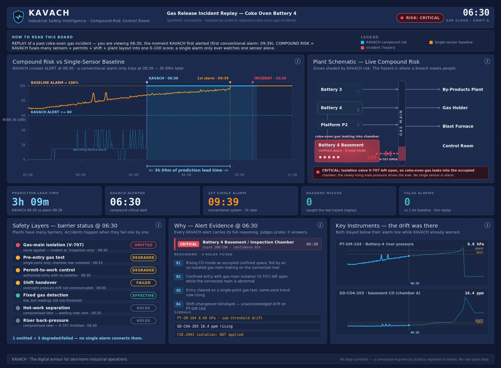
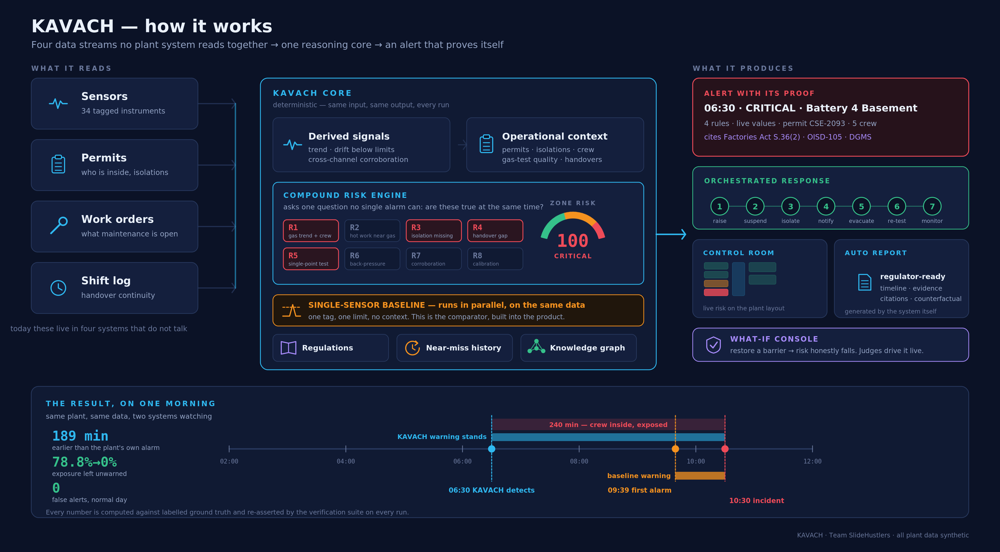

# KAVACH — कवच
### The digital armour for zero-harm industrial operations

**ET AI Hackathon 2.0 · Problem Statement 1 — AI-Powered Industrial Safety Intelligence for Zero-Harm Operations**
**Team SlideHustlers · Satyam Kumar**

> In January 2025, eight workers died at a steel plant when entrapped gases exploded in a coke oven battery — a facility with functioning gas detectors, permit-to-work controls, and SCADA. The investigation found the warning signals existed, but *"no intelligence layer connected those readings to operational decisions in time."*
>
> **KAVACH is that missing layer.**

- **Demo video (2 min 16 s):** [`docs/KAVACH_demo.mp4`](docs/KAVACH_demo.mp4) — every frame rendered from live engine output
- **Project report (16 pp):** [`docs/KAVACH_Project_Report.pdf`](docs/KAVACH_Project_Report.pdf) · [DOCX](docs/KAVACH_Project_Report.docx)
- **Pitch deck:** [`docs/kavach_pitch_deck.pptx`](docs/kavach_pitch_deck.pptx) · [PDF](docs/kavach_pitch_deck.pdf)
- **Architecture:** [`docs/architecture.svg`](docs/architecture.svg)
- **Run it yourself:** quickstart below — the full system runs locally with no API key, dataset or network access



## What it does

Every system in a plant watches **one** signal perfectly — a gas detector knows its ppm, the permit software knows its forms, the DCS alarms when one tag crosses one limit. Nothing watches the **combination**, and the combination is what kills. KAVACH fuses sensor *trends* with operational *context* — active permits and isolations, gas tests, work orders, shift handovers, plant connectivity — into a compound-risk intelligence layer that:

1. **Detects** dangerous combinations hours before any single-sensor alarm (8 explainable rules, zone risk scores with hysteresis);
2. **Proves** every alert — signals with live values, permits, confidence, and the governing regulation (Factories Act 1948 / OISD-STD-105 / DGMS) cited on the alert itself;
3. **Remembers** — Incident Pattern Intelligence mines the plant's own near-miss register and finds that *this accident was already written there*: "isolation omitted during confined-space entry" recurs in 3 of 12 records, with `NM-2312` as a near-exact precedent for the 06:30 condition;
4. **Audits** — a Quality & Compliance agent continuously checks live permits against OISD/Factories Act/DGMS requirements and emits findings with corrective actions and owners, *before* an inspector does;
5. **Acts** — an emergency orchestrator suspends permits, recommends isolation, notifies roles, sequences evacuation by plant connectivity, and auto-writes a regulator-ready prevention report (Markdown + PDF);
6. **Explains structurally** — an equipment/permit/risk knowledge graph (72 nodes, 80 edges) returns the exact subgraph implicated in any alert: which zones connect, which instruments watch them, which permits are in force, which rules fired, which clauses govern;
7. **Withstands challenge** — a live what-if console re-runs the engine on jury-injected conditions: restore a barrier and the risk honestly de-escalates.

## Headline numbers (measured, not claimed)

| Metric | Baseline (single-sensor) | KAVACH |
|---|---|---|
| First actionable warning | 09:39 | **06:30** |
| Warning before the incident (10:30) | 51 min | **240 min** |
| Prediction lead time | — | **+3 h 09 m (189 min)** |
| **False-negative rate** (of 240 min of worker exposure, how much passed unwarned) | 189 min unwarned — **78.8%** | **0 min — 0.0%** |
| False alerts on a fully benign day | 1 (calibration spike) | **0** (9 context suppressions) |
| Compliance findings on correctly-run permits | — | **0** (4 findings on the incident day, 2 critical) |

### Held-out evaluation — because one hand-built scenario proves nothing

A demo you wrote yourself is not evidence. So the engines are also scored across **120 randomly generated scenarios they have never seen** (hazard zone, failing barriers, drift rate, timings and noise all randomised; a third of them fully benign):

| Across 120 unseen scenarios | KAVACH | Baseline |
|---|---|---|
| Hazards detected | **100%** | 100% |
| Median lead time over the baseline | **+85 min** | — |
| Median false-negative rate | **0.0%** | 39.4% |
| False alerts on unseen benign days | **0.0%** | 0.0% |
| Warned earlier | **67 / 68** | — |

```bash
cd backend && python eval_run.py 120     # reproducible from seeds
```

That test initially **failed** in two ways — 4 missed hazards in a zone the rules had overfitted away from, and a 13.5% false-alert rate on benign days — and both were fixed at the root (multi-hop gas reachability; crediting intact barriers). The before/after and the one scenario where KAVACH still loses to the baseline are documented in [`docs/EVALUATION_MAP.md`](docs/EVALUATION_MAP.md) §A3.

> On false negatives we deliberately report the *hard* version. Counting "hazard windows never flagged at all" flatters the baseline to 0, because it does eventually alarm — one minute before the explosion still counts as a detection. So we measure what actually matters: of the 240 minutes workers were exposed, how many passed with no warning standing. Baseline: 189. KAVACH: 0.

Every number is computed by the built-in metrics lab against labelled ground truth, served live at `/api/metrics`, and asserted by the automated verification suite: `cd backend && python verify.py` → **ALL CHECKS PASSED**. The same suite, plus a production frontend build, runs in CI on every push ([`.github/workflows/verify.yml`](.github/workflows/verify.yml)).

> **Evaluating this submission?** [`docs/EVALUATION_MAP.md`](docs/EVALUATION_MAP.md) maps every judging criterion and every line of the problem statement's Evaluation Focus to the exact file that provides the evidence — including a section on the claims we deliberately do *not* make.

## The demo

Two scripted scenarios run on a **deterministic digital twin** of a coke-oven & by-products complex (11 zones, 34 realistically-tagged instruments, minute resolution, seeded — every run identical):

| Scenario | What it proves |
|---|---|
| `vizag_replay` (02:00→12:00) | The catch: a composite gas-release incident built from documented failure modes. Baseline stays green until 09:39; KAVACH goes CRITICAL at 06:30 with full evidence. |
| `normal_day` (06:00→14:00) | The restraint: tempting-but-benign co-occurrences. Baseline false-alarms on a calibration test; KAVACH reads the work order and stays quiet. |

**The demo moment:** one toggle flips the same morning between *Baseline view* (what the plant had) and *KAVACH view* (what it was missing).

## Quickstart

**Backend** (Python 3.10+):
```bash
cd backend
python -m venv .venv && .venv\Scripts\activate    # Linux/Mac: source .venv/bin/activate
pip install -r requirements.txt
python verify.py                                   # the full evidence suite — ALL CHECKS PASSED
uvicorn app.main:app --reload --port 8000
```

**Frontend** (Node 18+):
```bash
cd frontend
npm install
npm run dev        # → http://localhost:3000
```

Routes: `/` control room · `/whatif` what-if console · `/console` raw twin view.
Optional: copy `backend/.env.example` → `.env` for LLM alert narration (OpenAI). Without a key the system runs fully on deterministic templates — by design.

## Architecture



**Stack:** FastAPI + pure-Python engines (no ML runtime needed — the intelligence is signal fusion + causal rules) · Next.js 14, all visuals inline SVG (~91 kB first load) · WebSocket streaming at 4 Hz. **Deterministic core, agentic edges:** seeded twin, cached horizon, zero external dependencies; LLM narration is optional garnish with a hard fallback. The twin and a real plant share one interface — production deployment swaps the simulator for read-only OPC-UA/historian/e-PTW connectors and nothing downstream changes.

## Repository map

```
backend/app/simulator/   Deterministic plant twin (timeline builder + playback)
backend/app/risk/        signals · compound rules R1–R8 · baseline comparator ·
                         metrics lab (lead time + false-negative rate) ·
                         regulatory intelligence · patterns (near-miss mining) ·
                         compliance (audit agent + CAPA) · graph (knowledge graph) ·
                         orchestrator · auto-report · what-if · optional LLM narration
backend/verify.py        The evidence suite — asserts every claimed number
frontend/app/            Control room · what-if console · dev console
data/                    Plant layout · scenarios (+ ground truth) ·
                         regulatory clause library · near-miss register
design/                  BI-board design system + generator (dashboard.png/svg/html)
reports/                 Auto-generated incident-prevention report (MD + PDF)
docs/                    Report · deck · architecture · video · jury Q&A · deployment · evaluation map
```

**API surface:** `/api/state` `/api/risk` `/api/risk/alerts` `/api/metrics` `/api/baseline` `/api/patterns` `/api/compliance` `/api/graph` `/api/regulatory` `/api/orchestrator` `/api/whatif` `/api/report` + `WS /ws/stream`

## Data disclaimer

All plant data, sensor values, personnel names and event timelines are **synthetic**, generated by this repository's simulation engine. The incident scenario is a *fictional composite* informed by publicly reported incident investigations and public regulatory standards. No real plant data is used. All ideas, code, documents and assets were created during the hackathon.

## License & credits

MIT — see [`LICENSE`](LICENSE), which also carries the data-provenance note and an explicit statement that this is a research prototype and **not** a certified safety-instrumented system.

Built for ET AI Hackathon 2.0 (Economic Times × Unstop). Open-source dependencies only: FastAPI, Uvicorn, Pydantic, Next.js, React. No licensed or third-party datasets are used. AI-assisted development was used throughout, openly.

*"Railways built KAVACH for trains. We built it for the workers inside the plants."*
